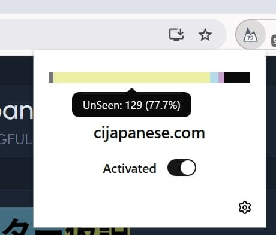

    
   <h3 align="center">Yama</h3>
   
acquire Japanese vocabulary on <mark>any</mark> website

# Yama :: Dictionary & Word Tracker

Yama (山) is a browser extension designed to help Japanese learners read web content or watch videos  more immersive and effectively. It turns any webpage into a study tool by providing instant dictionary lookups, word tracking, and jpdb sync.

Like LingQ、Migaku、relingo、trancy, but free and open source.

## Key Features

*   **Instant Dictionary Lookup**: Hover over any Japanese word to see its definition, reading. Supports multiple dictionary sources.
    *   *JPDB*
    *   *Jisho*

*   **Word Tracking**: By default all words are `UnSeen`, You can mark words as `Tracking`, `Ignored`, or `Never Forget`. Yama highlights words with different colors, giving you a clear overview of your vocabulary.

*   **AI Sentence Explanation**: You can config your own AI endpoint to get ai explanation.

*   **On-Page Statistics**: Click the extension icon to see a distribution chart of all highlighted words on the current page, giving you a quick glance at the comprehensible level of the page.

*   **[JPDB.io](https://jpdb.io/) Integration**: Automatically sync words you mark on webpages to your JPDB.io account to easily create flashcards.
     > highly recommended to enable jpdb synchronization, you can use it as a backup and review system.

*   **Highly Customizable**:
    *   Customize the highlight color and style (background, underline, etc.) for different word statuses.
    *   Configure the dictionaries you want to use.
    *   Set keyboard shortcuts to quickly mark words.

## Installation

1.  Download from the [Chrome Web Store]() (Coming Soon)

## Screenshots

|   |  |
| -------- | -------- | 
| web page  |   | 
| youtube |   | 
| youtube |   | 

## How to Use

1.  After installation, navigate to a Japanese website you want to read and click the Yama icon in your browser's toolbar.
2.  In the popup window, enable the switch to add the current site to the whitelist.
3.  Yama will automatically start analyzing and highlighting words.
4.  Hover over words to see their definitions.
5.  Use the floating panel's toolbar or keyboard shortcuts to mark words.
6.  Click the extension icon to view statistics for the current page.
7.  Click the extension icon then click settings icon to go to the options page for customize configuration (such as colors, jpdb sync or ai explain).

## Development

1.  Clone the repository: `git clone https://github.com/your-repo/yama.git`
2.  Install dependencies: `bun install`
3.  Start the development server: `bun dev`
4.  Load the `dist` folder as an unpacked extension in your browser.
